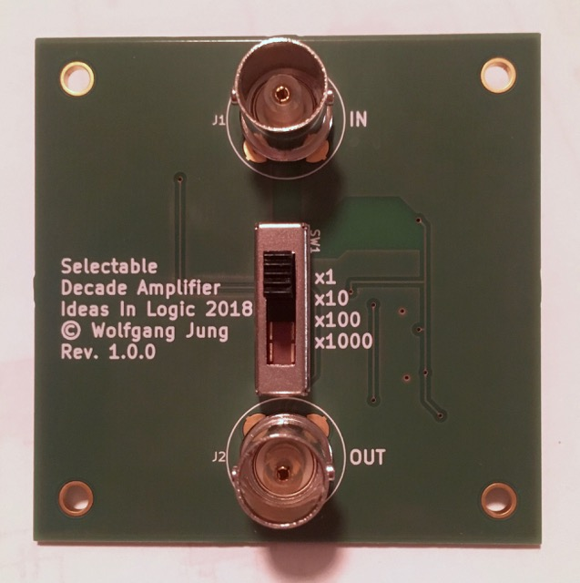
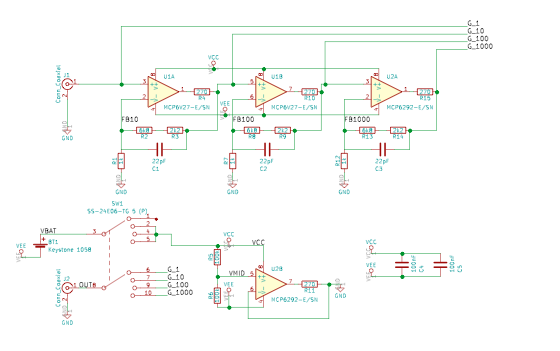
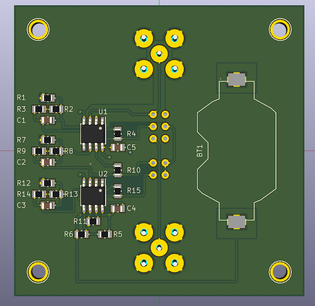
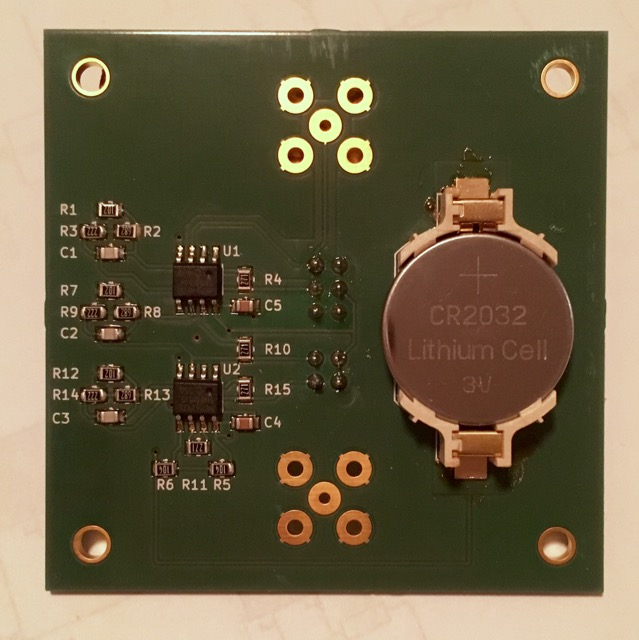

# Selectable Decade Amplifier

Due to my - in the highest sensitive ranges - a little bit noisy Rigol DS-1054z scope, I decided to provide a small pre-amplifier for low-voltage measurements (a.k.a. electret microphone signals, shunt-voltages, etc.).
For best performance in the micro-volt range, a dual stage amplifier (both stages provide 10V/1V gain) is built with the [MCP6V27](http://www.microchip.com/wwwproducts/en/MCP6V27). A third and last stage gives the final 10V/1V amplification resulting in a gain of 1000V/1V with a 3db cut-off at ~200 kHz.

For the third stage and the virtual ground a cheaper [MCP6292](http://www.microchip.com/wwwproducts/en/MCP6292) is used.

**The input voltage must not exceed ±1.5V!**

Current consumption should be ~1.6mA, the CR2032 coin-cell should last about 200h. The slide-switch disables the op-amps, if 1V/1V is selected.

Further improvements:
*  TVS-Diodes for clamping input voltage?

## Schematic

### BOM

Ref|QTY|Value|Mouser
---|---|---|---
BT1|1|Keystone 1058|Keystone 1058
C1, C2, C3|3|22pF|885012007002
C4, C5|2|100nF|C0805C104K5RACTU
J1, J2|2|Conn_Coaxial|TE-5-1634503-1
R1, R7, R12|3|1k|RR1220P-102-D
R2, R8, R13|3|6k8|RR1220P-682-D
R3, R9, R14|3|2k2|RR1220P-222-D
R6, R5|2|100k|RR1220P-104-D
R11, R4, R10, R15|4|270R|RC0805JR-07270RL
SW1|1|SS-24E06-TG 5 (P)|SS-24E06-TG 5 (P)
U1|1|MCP6V27-E/SN|MCP6V27-E/SN
U2|1|MCP6292-E/SN|MCP6292-E/SN

## Final device

## Licence 
[Attribution-NonCommercial 4.0 International (CC BY-NC 4.0)](https://creativecommons.org/licenses/by-nc/4.0/) 2018 Wolfgang Jung, Ideas In Logic - Jung & Kesten GbR
